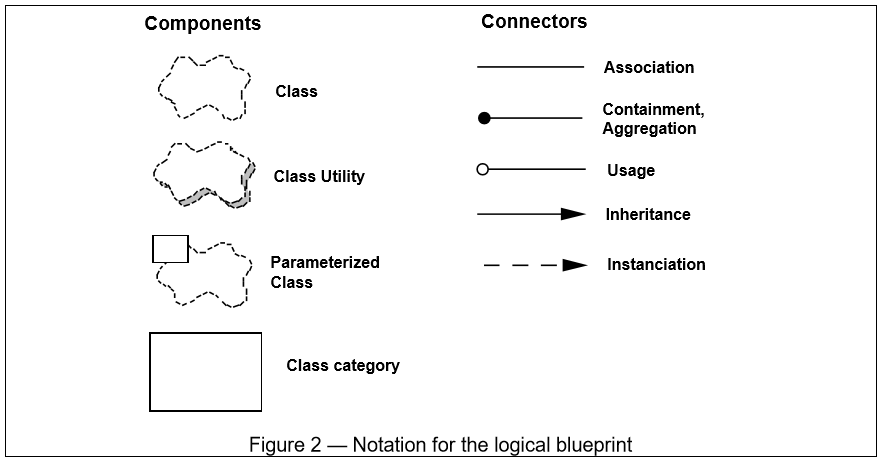

Table of Contents
=================

   * [Overview](#overview)
   * [The need](#the-need)
      * [Perry and Wolf's equation on architecture](#perry-and-wolfs-equation-on-architecture)
   * [Architecture Model](#architecture-model)
         * [Notations and Styles](#notations-and-styles)
         * [Logical Architecture](#logical-architecture)
            * [Diagrams used](#diagrams-used)
         * [The process architecture](#the-process-architecture)
            * [Diagrams used](#diagrams-used-1)
      * [Development Architecture](#development-architecture)
         * [Diagrams used](#diagrams-used-2)
   * [Physical Architecture](#physical-architecture)
   * [scenarios views.](#scenarios-views)

# Overview
This is a model for describing architecture of software systems.  
This uses multiple views to represent the architectural solution to a set of use-cases or scenarios 
These views are targeted at various stakeholders to address their primary concerns 

    - End user
    - Developers
    - Systems Engineers
    - Project Managers 
These views also factor in the solution for both functional and non-functional requirements 

As stated above, these views are designed with the main aim of communicating the architecture solution to address specific scenarios and is typically evolved in an iterative manner.

# The need
Communicating software architecture is difficult. As Martin Fowler puts it, 
> Software architecture is a collective understanding of the structure/form and behavior/function of a system. - Martin Fowler

The collective here is the team.
## Perry and Wolf's equation on architecture
Perry and wolf's equation on architecture states that  
> architecture = (Elements, Form, Rationale/Constraints)

In other words, architecture is a process of assembling select architectural elements in a particular well defined form or shape to meet various functional and non-functional requirements. 

# Architecture Model
Architecture document aims to enhance and influence the collective to arrive at a common understanding of the form and function of the proposed or prevailing system.  
Without getting into the fundamentals of what makes up a software architecture we can agree that a typical software architecture tries to present it in the form of abstract views, system broken down into its constituent parts, a view that depicts inter-dependencies, a view that shows physical locations and connectivities in the physical world and so on. 
In order to target maximum stakeholders, we will be using five views.
- **Logical view** This is an object oriented view of the design.
- **process view** this shows the behavioral view including the concurrency and synchronization aspects
- **physical view** this shows the software deployment view from an infrastructure perspective.
- **Development View** this shows the software organization in development environment.
-**scenario view** the four views can be illustrated using a few scenarios or use cases. This is the fifth view.
 
The four views are evaluated against Perry and Wolf's equation independently. 
To elaborate, each view will feature its *Elements* that are fitted together in a particular *form* following certain established patterns factoring in the constratints along with due rationale. 

### Notations and Styles
This is an opern approach and any suitable notation and style can be adopted especially for process and logical views

### Logical Architecture
This typically is a domain model represented as class diagrams that elucidate the entities and relationships in the problem domain.
This view helps with identifying categories. See samples below
  Images courtesy - [site](http://www.cs.ubc.ca/~gregor/teaching/papers/4+1view-architecture.pdf)

#### Diagrams used
- Class Diagrams
- State Chart 

### The process architecture
The process archtiecture tries to provide a behavioral view to highlight specific non-functional parameters such as 
 1. Performance, 
 2. Availability
 3. Fault tolerance
 4. concurrency
 5. Recoverability etc.,
The abstract class definitions given in the logical view are used here to depict their behavior when executing the scenarios and also depict process level (system level process) view of which is executed where and on what thread etc.,
The process view can be represented at different levels to address different concerns. AT its highest level, this can be something like an interaction view between system processes spread across sytems in a distributed network.  
**Process** an independent executable that runs on a system. The executable can be built, tested, configured, started, stopped, scaled independent of other processes. Another important, but obious thing to note is that processes typically run one or more threads to execute/service one or more jobs at a time  
**Jobs / Tasks** Jobs or tasks can be compared to an individual service request that is executed by a process to fullfil it. Typically a job or a task can be construed to be something that runs on a thread to service a request or complete a work.
    - Major tasks - are those which full service requests
    - Minor tasks - those that are ancilliary like a cache request, database calls etc.,
**System** a system comprises of a logical set of processes that implement a related set of features of a problem domain.

#### Diagrams used
- Interaction diagrams
    - Communication / Collaboration diagrams
    - Sequence Diagrams
    - Component Diagrams

## Development Architecture
This is  a structural view that focuses on 
- Software organization in development environment
- These can be libraries or even sub-systems
- ease of development
- SCM
- reuse
- toolset
- to communicate with dev teams on what they will work on
- to estimate, plan 
### Diagrams used
- Component diagram
- 

# Physical Architecture
This is a structural view that focuses on the deployment view and NFR characteristics

# scenarios views.
This is a behavioral model that depicts various business scenarios that form the basis of the architecture approach. 
